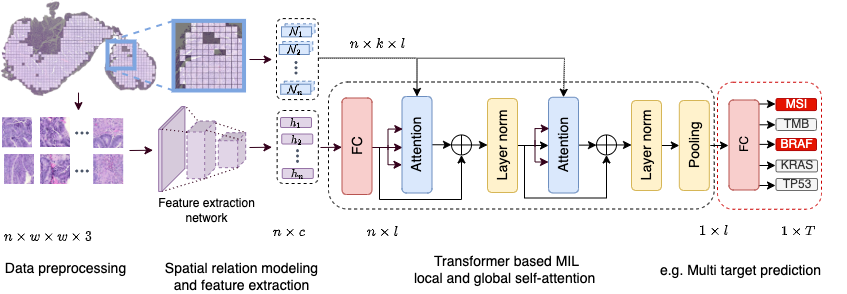

</img>


## Transformer based Multiple Instance Learning - PyTorch

Implementation of Transformer architectures for Multiple Instance Learning (MIL) in PyTorch.
Currently we have implemented a Graph Transformer for local attention ('LA_MIL') and a 
vanilla Transformer using global self attention ('GA_MIL'). 


## Installation
```bash
$ pip install tmil
```

## Data preprocessing: Tesselation and Feature Extraction
Whole slide image tesselation can for example be performed in parallel using <a href="https://github.com/ncoudray/DeepPATH/blob/master/DeepPATH_code/00_preprocessing/0b_tileLoop_deepzoom6.py">Coudray's code</a> and for feature extraction we used <a href="https://kimialab.uwaterloo.ca/kimia/index.php/data-and-code-2/kimia-net/">KimiaNet</a> and refer to their work for more information. 
**UPDATE**: We strongly recommend self-supervised pretrained feature extractors like <a href="https://github.com/Xiyue-Wang/RetCCL">RetCCL</a> and <a href="https://github.com/Xiyue-Wang/TransPath">TransPath</a> to obtain SOTA results in WSI analysis. Check our updated results with RetCCL at the bottom. A large scale study from my colleague evaluating GA_MIL equipped with TransPath is in preparation. Stay tuned!

## Usage
```python
import torch, dgl, random
from tmil import T_MIL


#data
batch_size = 1 #num of WSIs=1
num_tiles = 1000 #num of used tiles from WSI
tile_dim = 1024 #or feature dimension, dependent on feature extractor
num_classes = 4 #num of targets to predict
tile_coords = torch.tensor([(random.random(), random.random()) for _ in range(num_tiles)]) #tile coordinates from WSI
knn1, knn2 = 16, 64 #adapt to your task 
g1, g2 = dgl.knn_graph(tile_coords, knn1), dgl.knn_graph(tile_coords, knn2) #graphs
wsi = torch.randn(batch_size, num_tiles, tile_dim) 

#model 
m = T_MIL(
    n_classes=num_classes,
    architecture='LA_MIL',
    feat_dim=tile_dim,
    latent_dim=512,
    num_heads=8,
    depth=2
)

logits = m(wsi, graphs=[g1, g2]) 

#Multi Target (e.g, predict if multiple mutations are present: TP53 True, BRAF True, MSI False, TMB True <-> [1, 1, 0, 1]
multi_target_binaries = torch.where(torch.sigmoid(logits) > 0.5, 1., 0.) 
```

## Local attention - Change the neighborhoods


You can change the neighborhood size according to your particular task as an user-specified inductive bias.
```python
knn1, knn2, knn3 = 16, 64, 128 #adapt to your task 
g1, g2, g3 = dgl.knn_graph(tile_coords, knn1), dgl.knn_graph(tile_coords, knn2), dgl.knn_graph(tile_coords, knn3)
wsi = torch.randn(batch_size, num_tiles, tile_dim)

#model 
m = T_MIL(
    n_classes=num_classes,
    architecture='LA_MIL',
    feat_dim=tile_dim,
    latent_dim=512,
    num_heads=8,
    depth=4 #if depth>num_graphs, the last graph will be repeated for remaining layers
)

logits = m(wsi, graphs=[g1, g2, g3]) 
```


However, depending on your GPU capabilities and what you want to investigate in whole slide images, you can also use <a href="https://arxiv.org/pdf/1706.03762">global self-attention</a>. In this case we have the classical all-to-all attention mechanism,
you can change the architecture parameter to 'GA_MIL':

```python
wsi = torch.randn(batch_size, num_tiles, tile_dim)

#model 
m = T_MIL(
    n_classes=num_classes,
    architecture='GA_MIL', 
    feat_dim=tile_dim,
    latent_dim=512,
    num_heads=8,
    depth=2 
)

logits = m(wsi) 
```

## Visualisation of Attention and latent space 

</img>

You can visualise attentive regions and also catch the embedding, which is the output of the mean pooling operation. 

```python
wsi = torch.randn(batch_size, num_tiles, tile_dim)

#model 
m = T_MIL(
    n_classes=num_classes,
    architecture='GA_MIL', 
    feat_dim=tile_dim,
    latent_dim=512,
    num_heads=8,
    depth=4 
)

logits, emb, att = m(wsi, return_last_att=True, return_emb=True) 

emb, att #[1,latent_dim], [num_tiles]

```


## Updated Results
Using <a href="https://github.com/Xiyue-Wang/RetCCL">RetCCL</a> as feature extraction network and changing the first fully connected layer from 1024->512 to 2048->512, LA_MIL achieves dramatic performance boosts in 5-Fold CV on TCGA Colorectal and Stomach Cancer. Results given as mean AUROC and variance across folds. 

|   Multi-target    |     MSI     |     TMB     |     BRAF    |     ALK     |    ERBB4    |    FBXW7    |     KRAS    |    PIK3CA   |    SMAD4    |     TP53    |
|:-----------------:|:-----------:|:-----------:|:-----------:|:-----------:|:-----------:|:-----------:|:-----------:|:-----------:|:-----------:|:-----------:|
|  TCGA-CRC (n=594) | 0.91 (0.03) | 0.87 (0.08) | 0.79 (0.08) | 0.67 (0.11) | 0.68 (0.12) | 0.69 (0.12) | 0.62 (0.08) | 0.60 (0.07) | 0.61 (0.03) | 0.70 (0.05) |
| TCGA-STAD (n=440) | 0.83 (0.07) | 0.82 (0.06) | 0.66 (0.05) | 0.59 (0.05) | 0.59 (0.08) | 0.75 (0.17) | 0.66 (0.22) | 0.66 (0.14) | 0.65 (0.08) | 0.53 (0.08) |

We further extend our results in an external validation on CPTAC COAD, scores given as AUROC:
|  Multi-target   |  MSI |  TMB |
|:---------------:|:----:|:----:|
| CPTAC-COAD (n=357) | 0.83 | 0.81 |


## Citations

If you find this repo useful for your research, please consider citing our paper:
```bibtex
@incollection{Reisenbuechler2022,
  author = {Daniel Reisenbüchler and Sophia J. Wagner and Melanie Boxberg and Tingying Peng},
  title = {Local Attention Graph-Based Transformer for Multi-target Genetic Alteration Prediction},
  doi = {10.1007/978-3-031-16434-7_37},
  url = {https://doi.org/10.1007/978-3-031-16434-7_37},
  year = {2022},
  publisher = {Springer Nature Switzerland},
  pages = {377--386},
  booktitle = {Lecture Notes in Computer Science}
}
```
