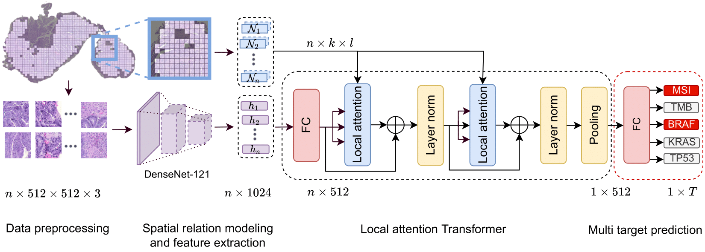
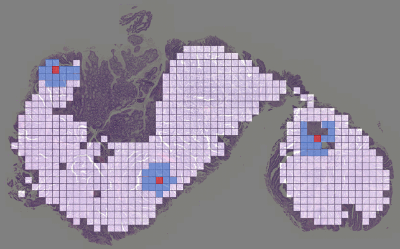
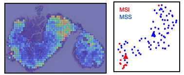

</img>

## Updated Results
Using as feature extraction network and changing the first fully connected layer from 1024->512 to, LA_MIL achieves dramatic performance boosts in 5-Fold CV on TCGA Colorectal and Stomach Cancer. Results given as mean AUROC and variance across folds. 

|   Multi-target    |     MSI     |     TMB     |     BRAF    |     ALK     |    ERBB4    |    FBXW7    |     KRAS    |    PIK3CA   |    SMAD4    |     TP53    |
|:-----------------:|:-----------:|:-----------:|:-----------:|:-----------:|:-----------:|:-----------:|:-----------:|:-----------:|:-----------:|:-----------:|
|  TCGA-CRC (n=594) | 0.91 (0.03) | 0.87 (0.08) | 0.79 (0.08) | 0.67 (0.11) | 0.68 (0.12) | 0.69 (0.12) | 0.62 (0.08) | 0.60 (0.07) | 0.61 (0.03) | 0.70 (0.05) |
| TCGA-STAD (n=440) | 0.83 (0.07) | 0.82 (0.06) | 0.66 (0.05) | 0.59 (0.05) | 0.59 (0.08) | 0.75 (0.17) | 0.66 (0.22) | 0.66 (0.14) | 0.65 (0.08) | 0.53 (0.08) |

We further extend our results in an external validation on CPTAC COAD:
|  Multi-target   |  MSI |  TMB |
|:---------------:|:----:|:----:|
| CPTAC-COAD (n=357) | 0.83 | 0.81 |


## Local Attention Multiple Instance Learning - PyTorch

Implementation of LA_MIL in PyTorch.

**Pip package and code follow asap. Stay tuned**


## Installation

## Data preprocessing: Tesselation and Feature Extraction


## Local attention - Change the neighborhoods


You can change the neighborhood size according to your particular task as an user-specified inductive bias.


## Visualisation of Attention and latent space 

</img>

You can visualise attentive regions and also catch the embedding, which is the output of the mean pooling operation. 


## Citations

If you find this repo useful for your research, please consider citing our paper:
```bibtex
@incollection{Reisenbuechler2022,
  author = {Daniel Reisenbüchler and Sophia J. Wagner and Melanie Boxberg and Tingying Peng},
  title = {Local Attention Graph-Based Transformer for Multi-target Genetic Alteration Prediction},
  doi = {10.1007/978-3-031-16434-7_37},
  url = {https://doi.org/10.1007/978-3-031-16434-7_37},
  year = {2022},
  publisher = {Springer Nature Switzerland},
  pages = {377--386},
  booktitle = {Lecture Notes in Computer Science}
}
```
