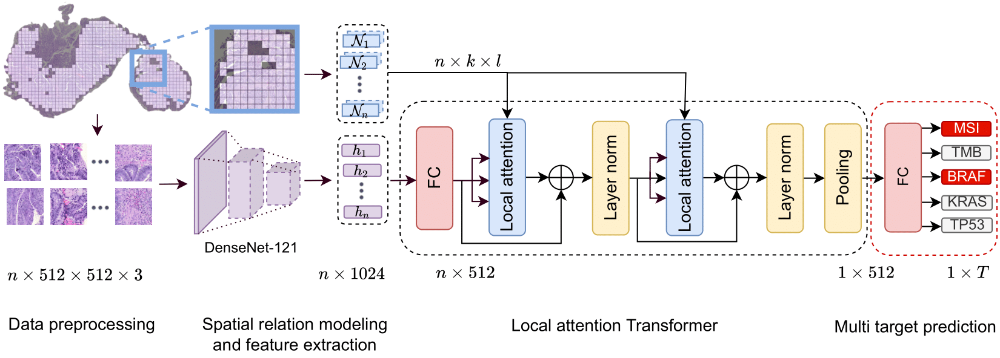
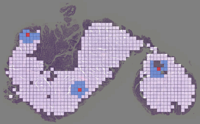
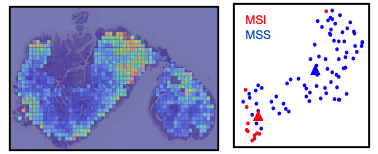

</img>


## Local Attention Multiple Instance Learning - PyTorch

Implementation of LA_MIL in PyTorch.


## Local attention - Change the neighborhoods


You can change the neighborhood size according to your particular task as an user-specified inductive bias.


## Visualisation of Attention and latent space 

</img>

You can visualise attentive regions and also catch the embedding, which is the output of the mean pooling operation. 


Pip package and code follow asap. Stay tuned


## Citations

If you find this repo useful for your research, please consider citing our paper:
```bibtex
@incollection{Reisenbuechler2022,
  author = {Daniel Reisenbüchler and Sophia J. Wagner and Melanie Boxberg and Tingying Peng},
  title = {Local Attention Graph-Based Transformer for Multi-target Genetic Alteration Prediction},
  doi = {10.1007/978-3-031-16434-7_37},
  url = {https://doi.org/10.1007/978-3-031-16434-7_37},
  year = {2022},
  publisher = {Springer Nature Switzerland},
  pages = {377--386},
  booktitle = {Lecture Notes in Computer Science}
}
```
